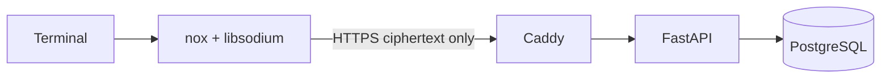

# NOX VAULT

```text
 _   _  ___ __  __  __     ___   _   _ _   _____
| \ | |/ _ \\ \/ /  \ \   / /_\ | | | | | |_   _|
|  \| | (_) |>  <    \ \ / / _ \| |_| | |__ | |
|_|\__|\___//_/\_\    \_/_/ \_\_\___/|____||_|
```

**Your secrets leave your machine only as ciphertext.**

NOX VAULT is an educational multi-user secrets vault. Its C++20 client encrypts and decrypts records locally; FastAPI and PostgreSQL store authenticated opaque records.

> Nox Vault is an educational coursework project. It demonstrates secure design principles but has not undergone an independent professional security audit and should not be treated as a replacement for a professionally audited password manager.

## Features and security boundary

- Argon2id derives a KEK from the vault master password and a random salt.
- A random 256-bit Vault Key is wrapped by the KEK (envelope encryption).
- XChaCha20-Poly1305 provides authenticated Secret, name and backup encryption with fresh nonces and contextual AAD.
- Password rotation re-wraps the Vault Key without re-encrypting every Secret.
- Optional private metadata encrypts Secret names locally.
- Optimistic record versions prevent silent stale updates.
- A user-scoped local agent supports `unlock` across terminals with idle and absolute timeouts.
- Encrypted export/import never creates a plaintext backup.

The API never defines fields for the vault master password, plaintext Secret, KEK or decrypted Vault Key. It does receive the separate account password over HTTPS for server authentication. See [cryptography](docs/CRYPTOGRAPHY.md), [threat model](docs/THREAT_MODEL.md), [architecture](docs/ARCHITECTURE.md) and [API](docs/API.md).



## Repository

```text
client/                 C++20 CLI, local agent, crypto and Catch2 tests
server/                 FastAPI, SQLAlchemy, Alembic and pytest tests
docs/                   architecture, crypto, threat model and API
deploy/                 Caddy and production environment template
.github/workflows/      CI
scripts/tamper_demo.py  educational AEAD tampering demonstration
docker-compose.yml      local development stack
docker-compose.prod.yml production stack
```

## End-user installation

Release builds contain the official endpoint `https://api.noxvault.tech`; normal users do not configure `server_url`. Download the newest file for your computer from the [GitHub Releases page](https://github.com/Progerleonid/NOX-Vault/releases/latest):

| Platform | Download | Install |
| --- | --- | --- |
| Windows 10/11 x64 | `Windows-x86_64.exe` | Double-click the setup file, allow it to add NOX Vault to `PATH`, then open a new PowerShell window. |
| macOS Apple Silicon | `Darwin-arm64.pkg` | Double-click the package and follow Installer. |
| macOS Intel | `Darwin-x86_64.pkg` | Double-click the package and follow Installer. |
| Ubuntu/Debian x64 | `Linux-x86_64.deb` | Double-click it in the software installer, or run `sudo apt install ./nox-vault-*.deb`. |
| Fedora/RHEL x64 | `Linux-x86_64.rpm` | Double-click it in the software installer, or run `sudo dnf install ./nox-vault-*.rpm`. |
| Linux ARM64 | `Linux-arm64.deb` or `.rpm` | Install it with the matching Debian/Fedora command above. |

The installer contains the client and its required libraries; users do not need CMake, a compiler, vcpkg, curl or libsodium. Portable `.zip`/`.tar.gz` archives and `SHA256SUMS.txt` are attached to the same release. The first unsigned builds may show an operating-system trust warning until Windows and Apple code-signing certificates are configured.

After installation, open a new terminal and verify it:

```bash
nox --version
nox register
```

Maintainers create all installers by pushing a version tag matching `client/CMakeLists.txt`, for example `git tag v0.2.4 && git push origin v0.2.4`. The release workflow builds and tests each native binary before publishing it.

## Building from source

Most users should use a release installer above. The following is for contributors and unsupported platforms.

Ubuntu/Debian build prerequisites:

```bash
sudo apt update
sudo apt install -y build-essential cmake ninja-build g++ git pkg-config \
  libsodium-dev libcurl4-openssl-dev
git clone https://github.com/microsoft/vcpkg "$HOME/vcpkg"
"$HOME/vcpkg/bootstrap-vcpkg.sh"
cmake -S client -B client/build -G Ninja \
  -DCMAKE_BUILD_TYPE=Release \
  -DCMAKE_TOOLCHAIN_FILE="$HOME/vcpkg/scripts/buildsystems/vcpkg.cmake"
cmake --build client/build
ctest --test-dir client/build --output-on-failure
sudo cmake --install client/build --prefix /usr/local
cd /tmp && nox --version
```

For a per-user install, use `--prefix "$HOME/.local"` and ensure `$HOME/.local/bin` is in `PATH`.

Windows with Visual Studio 2022 and vcpkg:

```powershell
git clone https://github.com/microsoft/vcpkg "$env:USERPROFILE\vcpkg"
& "$env:USERPROFILE\vcpkg\bootstrap-vcpkg.bat"
cmake -S client -B client/build -A x64 `
  -DCMAKE_TOOLCHAIN_FILE="$env:USERPROFILE\vcpkg\scripts\buildsystems\vcpkg.cmake"
cmake --build client/build --config Release
ctest --test-dir client/build -C Release --output-on-failure
cmake --install client/build --config Release --prefix "$env:LOCALAPPDATA\Programs\Nox"
```

Add `%LOCALAPPDATA%\Programs\Nox\bin` to the user `PATH` once, open a new terminal, then run `nox.exe --version` from any directory. The vcpkg manifest supplies CLI11, libcurl, nlohmann-json, libsodium and Catch2.

## First use and normal workflow

```text
$ nox register
Email: alice@example.com
Account password: ************
Account created as alice@example.com.

$ nox init
Vault master password: ************
Confirm vault master password: ************
Encrypted vault initialized.

$ nox unlock
Vault master password: ************
Vault unlocked for 15 minutes of inactivity.

$ nox add github
Secret value: ************
Done.

$ nox get github
ghp_example
```

After `nox unlock`, another terminal for the same OS user can run `nox list`, `nox get github`, `nox update github` and `nox remove github`. `nox lock` or `nox logout` clears the local unlocked session. `nox status`, `nox doctor`, `nox passwd`, `nox export backup.nox`, `nox import backup.nox`, and `nox shell` cover diagnostics, rotation, portability and an interactive session. Values/passwords are prompted with terminal echo disabled; do not put them on command lines.

`nox config set server_url https://host` is only for developers, tests and self-hosting. Plain non-loopback HTTP, embedded user information, URL paths, queries and fragments are rejected. `nox config unset server_url` restores the official service.

## Backend development

```bash
cp .env.example .env
docker compose up --build -d
curl http://localhost:8000/api/v1/health

cd server
python -m pip install -e ".[dev]"
alembic upgrade head
pytest
ruff check .
```

The local Compose binds PostgreSQL and FastAPI to loopback only. Production uses `docker-compose.prod.yml`, Caddy automatic TLS, internal PostgreSQL networking, uncommitted environment secrets and persistent volumes.

On the dedicated Ubuntu VPS, copy the repository to `/opt/nox-vault` and run `sudo bash deploy/deploy.sh`. The script installs Docker from its official Ubuntu repository when needed, generates the uncommitted production secrets on the VPS, restricts UFW to SSH/80/443, starts migrations and containers, and fails unless the public HTTPS health endpoint succeeds. It deliberately preserves the selected root/password SSH policy.

For C++ diagnostics with compatible GCC/Clang builds, add `-DNOX_ENABLE_SANITIZERS=ON`. Warnings are `/W4 /permissive-` on MSVC and `-Wall -Wextra -Wpedantic -Wconversion -Wshadow` elsewhere.

## Tampering demonstration

Install PyNaCl in an isolated environment and run:

```bash
python scripts/tamper_demo.py
```

The script creates a record whose representation does not contain the known plaintext, flips one ciphertext byte, and verifies that XChaCha20-Poly1305 rejects it. The actual C++ test suite separately covers ciphertext, nonce and AAD modification.

## Limitations

- Client malware, keyloggers or a compromised binary can capture plaintext and keys.
- An attacker knowing the master password can decrypt a stolen vault record set.
- Private metadata does not conceal identifiers, sizes, timing or access patterns.
- Login rate limiting is in-process, not a distributed production-grade limiter.
- Secure wiping is best effort because standard C++/JSON/OS components can copy or page memory.
- The server can delete, replay or withhold ciphertext; this design is not a complete rollback-resistant protocol.
- Release installers are not code-signed yet, and automatic updates are not implemented.
