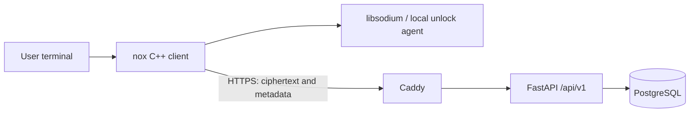
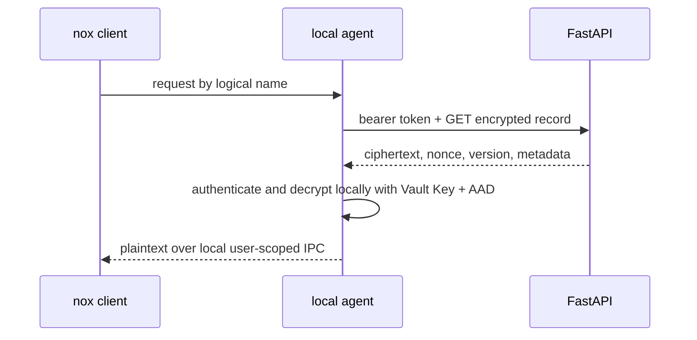

# NOX VAULT architecture

## Overview and trust boundary

The C++20 client is the cryptographic endpoint. FastAPI authenticates accounts and stores only opaque cryptographic records in PostgreSQL. Caddy terminates public TLS; only Caddy publishes ports on production.



`main.cpp` defines commands and prompts. `ConfigManager` stores non-secret preferences and the bearer session, `AuthManager` performs account authentication, `ApiClient` validates transport and responses, `VaultService` implements vault workflows, `BackupService` handles encrypted portability, and `CryptoService` is the libsodium boundary. The local agent retains a decrypted Vault Key in one per-user process with idle and absolute timeouts; its IPC endpoint is user-scoped.

The server is split into API routers, Pydantic schemas, repositories, SQLAlchemy models, security middleware and Alembic migrations. It has no endpoint field for a master password, plaintext Secret or decrypted Vault Key.

## Workflows

### Vault initialization and Secret creation

```mermaid
sequenceDiagram
    actor User
    participant Client as nox client
    participant Sodium as libsodium
    participant API as FastAPI
    User->>Client: master password and Secret
    Client->>Sodium: Argon2id(password, random salt) -> KEK
    Client->>Sodium: random Vault Key; wrap with XChaCha20-Poly1305
    Client->>API: wrapped key, nonce, salt, KDF parameters
    Client->>Sodium: encrypt Secret with Vault Key, fresh nonce and AAD
    Client->>API: name/encrypted_name, ciphertext, nonce, format
```

### Secret retrieval



### Master-password rotation

```mermaid
sequenceDiagram
    actor User
    participant Client
    participant API
    User->>Client: old and new master passwords
    Client->>API: GET wrapped Vault Key and KDF parameters
    Client->>Client: derive old KEK and authenticate/unlock Vault Key
    Client->>Client: new salt + Argon2id -> new KEK; re-wrap same Vault Key
    Client->>API: PUT /vault/key with new wrapped key/KDF fields
    Note over Client,API: Existing Secret ciphertext is unchanged
```

Encrypted export authenticates the current wrapped key, encrypts the complete serialized record set under the Vault Key with backup-specific AAD, and writes only the encrypted envelope. Import authenticates/decrypts locally, validates identifiers and metadata, then submits opaque records to `/restore`.

## Database entities

```mermaid
erDiagram
    USERS ||--o| VAULTS : owns
    USERS ||--o{ AUDIT_EVENTS : produces
    VAULTS ||--o{ SECRETS : contains
    USERS { uuid id PK; string email UK; string password_hash }
    VAULTS { uuid id PK; uuid user_id UK; bytes encrypted_vault_key; bytes vault_key_nonce; bytes kdf_salt; bool private_metadata }
    SECRETS { uuid id PK; uuid vault_id FK; string name; bytes encrypted_name; bytes ciphertext; bytes nonce; int record_version }
    AUDIT_EVENTS { uuid id PK; uuid user_id FK; string event_type; uuid resource_id }
```

Visible metadata mode enforces a unique `(vault_id, name)`. Private metadata stores encrypted names; lookup and duplicate interpretation are client-side. `record_version` implements optimistic concurrency on updates.
